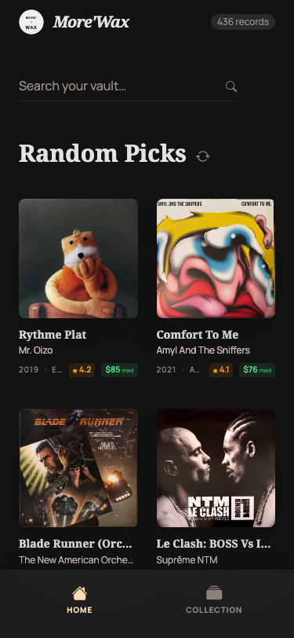
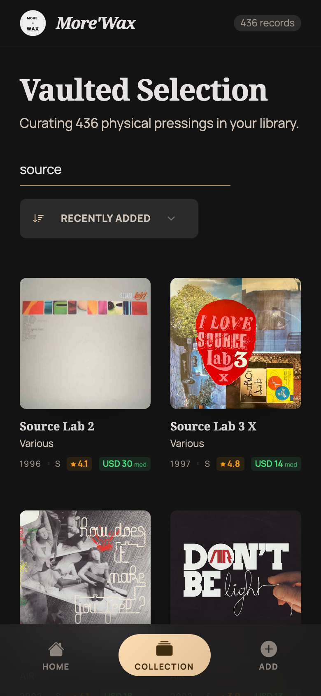
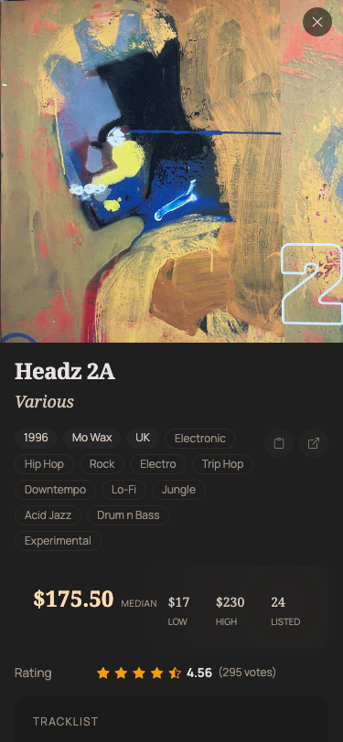
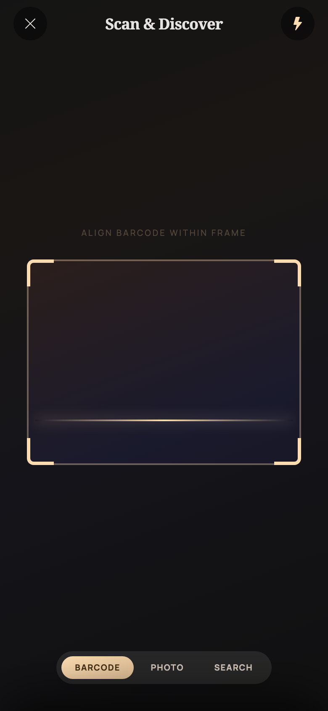
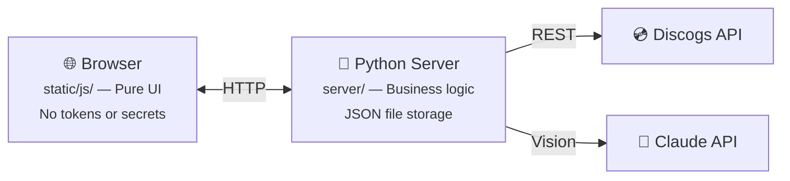

# More'Wax — Vinyl Collection Manager

More'Wax is a self-hosted web app for managing your vinyl record collection. It runs a Python server on your computer and serves a responsive web UI you open in any browser — desktop or mobile. Records can be added by barcode scan, cover photo identification (via Claude Vision), or manual Discogs search. Prices are fetched from the Discogs marketplace and new additions are automatically synced to your Discogs account.

**A [Discogs personal access token](https://www.discogs.com/settings/developers) is required** — More'Wax uses your Discogs account to search releases, fetch prices, and sync your collection.

**An [Anthropic API key](https://console.anthropic.com/) is optional** — only needed for photo-based cover identification (Claude Vision). Barcode scanning and manual search work without it. Each photo identification costs ~$0.007 with Claude Sonnet (~$0.70 per 100 photos).


<p align="center">
  
  
  
  
</p>

## Quick start

### Option A: Docker run

```bash
docker run -d \
  --name more-wax \
  -p 8765:8765 -p 8766:8766 \
  -v morewax-data:/app/data \
  eboudrant/more-wax:latest
```

### Option B: Docker Compose

```bash
docker compose up -d
```

### Option C: Run locally

```bash
python3 server.py
```

Open `https://localhost:8766` in a browser and accept the self-signed certificate. A setup wizard will guide you through connecting your Discogs account and (optionally) enabling Claude Vision for cover photo identification.

On your phone or another device, use `https://<your-ip>:8766`. **Camera features (barcode scan, photo) require HTTPS** — on plain HTTP only collection browsing is available.

Press Ctrl+C to stop the server.

## Configuration

API tokens (Discogs, Anthropic) are configured through the in-app setup wizard on first launch. They are saved to `data/.env` and persist across restarts.

You can also set configuration via environment variables (these override the wizard values):

| Variable | Required | Description |
|----------|----------|-------------|
| `DISCOGS_TOKEN` | Yes | Discogs personal access token ([get one here](https://www.discogs.com/settings/developers)) |
| `ANTHROPIC_API_KEY` | No | Anthropic API key for cover photo identification ([get one here](https://console.anthropic.com/)) |
| `VISION_MODEL` | No | Claude model for cover identification (default: `claude-sonnet-4-6`) |
| `HTTP_PORT` | No | HTTP port (default: `8765`) |
| `HTTPS_PORT` | No | HTTPS port (default: `8766`) |

## Architecture

More'Wax follows a **fat server / thin client** architecture. All API tokens, business logic, and external service calls live on the Python backend. The browser client is pure UI — it knows nothing about Discogs credentials or Claude API keys.



### Data storage

```
data/                       # auto-created, git-ignored
├── collection.json         # main database
├── covers/                 # locally captured cover photos
│   └── cover_42.jpg
├── server.crt              # auto-generated TLS cert
└── server.key
```

## Features

### Adding records

Three methods for adding vinyl to the collection:

1. **Photo** — Take or upload a photo. The app first tries barcode detection on the still image. If no barcode is found, it sends the image to Claude Vision for cover identification. The identified artist/title is then searched on Discogs.

2. **Live scan** — Point the camera at a barcode. Quagga.js runs in LiveStream mode with a confidence threshold (3 consistent reads required). Once detected, automatically searches Discogs.

3. **Manual search** — Type artist, album, or label name. Results show cover thumbnails, year, label, and format.

After selecting a release, a confirmation screen shows full metadata, marketplace prices, and lets the user take/upload a custom cover photo and add personal notes before saving.

### Marketplace prices

Three price tiers are tracked per record: Low (lowest listed), Median (VG+ suggested), and High (Near Mint suggested). Prices are fetched when a release is selected, when a detail modal is opened (if missing), and via a one-per-session background batch refresh for stale records. The batch refresh runs server-side with rate-limit delays and stops on 429 responses.

### Discogs sync

New records are automatically added to your Discogs collection (folder 1). If already present, sync is skipped.

### Cover photos

Cover images come from Discogs by default. Users can take or upload a custom cover photo. HEIC files (from iPhone) are converted to JPEG using a fallback chain: `sips` (macOS) → `heic2any` (browser) → native decoder.

### Error handling

On startup the client checks `/api/status` and shows actionable error banners if the Discogs token is missing or invalid. Attempting to use photo mode without an Anthropic API key shows a dialog explaining how to configure it.

### HTTPS and mobile

Camera access requires a secure context. The server auto-generates a self-signed TLS certificate for HTTPS. On mobile, open the HTTPS URL and accept the certificate warning once.

## Dependencies

### Server (Python 3)

No pip packages required — uses only stdlib modules: `http.server`, `json`, `ssl`, `urllib`, `threading`, `subprocess`, `base64`, `concurrent.futures`.

External tools (optional, for HEIC conversion): `sips` (macOS built-in), `convert` (ImageMagick), `ffmpeg`.

### Client (browser)

Loaded from CDN, no build step:

- Bootstrap 5.3.2 (CSS + JS)
- Bootstrap Icons 1.11.3
- Quagga.js 0.12.1 (barcode scanning)
- heic2any 0.0.4 (HEIC conversion fallback)

### External APIs

- **Discogs API** — Personal access token auth. Used for search, release metadata, marketplace pricing, and collection management.
- **Anthropic Claude API** (optional) — Used for cover photo identification via Claude Vision.

## Testing

CI runs Python checks (syntax, imports, unit tests, lint, security) and screenshot tests on every push and PR.

Screenshot tests use Playwright inside Docker to ensure pixel-perfect rendering regardless of the host OS. Tests run against both mobile (390×844) and desktop (1280×800) viewports.

```bash
# Build the test image (required once, or after dependency changes)
npm run test:screenshots:build

# Run screenshot tests
npm run test:screenshots

# Regenerate baselines after intentional UI changes
npm run test:screenshots:update
```

## Advanced: environment variables

The setup wizard is the recommended way to configure More'Wax. For advanced use cases (CI, scripting, Docker Compose), you can set tokens via environment variables instead — they take precedence over wizard-saved values.

```bash
# Docker: pass tokens directly
docker run -d \
  -e DISCOGS_TOKEN=your-token \
  -e ANTHROPIC_API_KEY=your-key \
  -p 8765:8765 -p 8766:8766 \
  -v morewax-data:/app/data \
  eboudrant/more-wax:latest

# Local: export before running
export DISCOGS_TOKEN=your-token
python3 server.py
```

See `.env.example` for all available variables.

## Contributing

1. Fork the repository
2. Create a feature branch (`git checkout -b feature/my-feature`)
3. Commit your changes (`git commit -m 'Add my feature'`)
4. Push to the branch (`git push origin feature/my-feature`)
5. Open a Pull Request

## Built with

This project was entirely vibe-coded using [Claude Code](https://claude.ai/code) and [Google Stitch](https://stitch.withgoogle.com/).

## License

[MIT](LICENSE)
